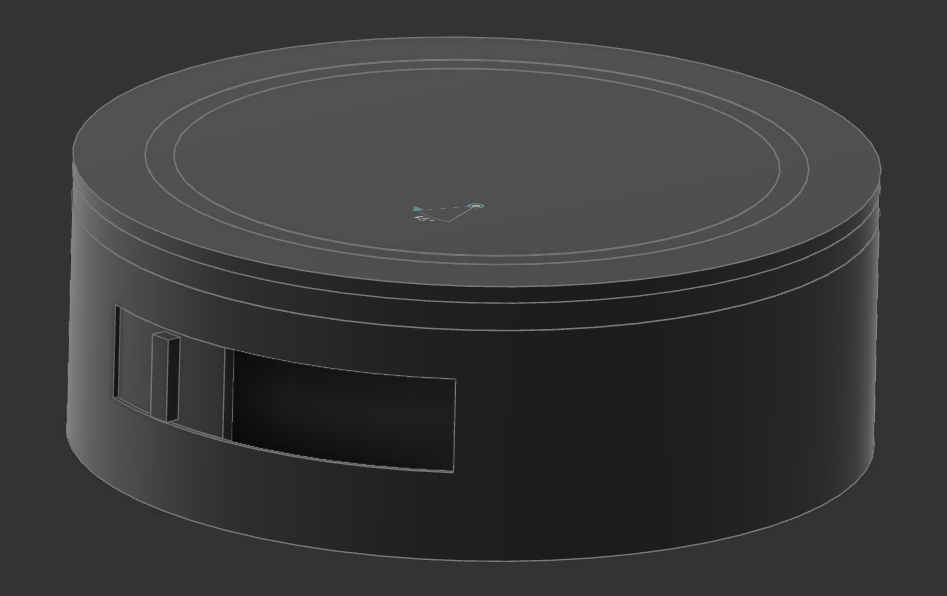

# AHS-Specifikace hrubý popis
Specifikace AHS (Automatické Herní Stanoviště), nástupcem Lucerny a BlackBoxu
Jde o statické zařízení sloužící jako herní stanoviště.
Mělo by tedy být mobilní jen natolik aby nebyl problém jej přepravovat.
Není ale cílem aby ho hráči nosil během hry nosil s sebou.

# Konkrétní požadavky
- Dva LED kruhy jeden radiální a jeden axiální (tak jak na lucerně)
- Tlaková plocha (tak jak na lucerně ale doladit samotnou kontaktní plochu aby se zvýšila spolehlivost)
- Výdrž na baterii alespoň pět hodin aby bylo možné organizovat čtyřhodinovou hru s rezervou na nastavování atd.
- Elegantní zapínání (znamená ne powerbankou a kabelem!!!)
- Snadná montáž (znamená ne 16h na jeden kus)
- Servisně snadné připojený komunikační/GPS modul uvnitř zařízení (A9, MC60 ???)
- Servisně snadné připojená dvířka a jiné moduly vně základního zařízení
- Základní zvuková odezva (pískle, na pokročilejší zvuk bude modul)

# Základní struktura elektroniky

Elektronika je rozdělena na dvě desky, Led dsku a Hlavní desku.

## LedDeska

Oproti předchozím verzím je přidán LED-kruh i na druhou stranu LedDesky abychom se zbavili LED-pásku a odebrat výstupní konektor
- Přední axiální LEDkoví kruh z 60ti RGB LEDek
- Zadní radiální LEDkoví kruh z 60ti RGB LEDek (buď přímo radiální [buce cca třikrát dražší] nebo axiální s odraznou plochou [radializátorem])
- LDC1614 nebo LDC1314 + čtyři snímací cívky pro snímání tlakové plochy

## Hlavní deska 
- ESP32-S3
- jednočlánek
- Interní systémy
    - dohodnutí PD
    - bzučák (bez oscilátorové)
    - Power manager
        - zapínání
        - step-up na 5V
        - LDO na 3V3
        - nabíječka
- Konektory na
    - ledDesku
    - komunikační modul
    - externí moduly
    - USB-C (nabíjení a primární programování [USB přímo z ESP, nebudeme zabírat místo převodníkem])
    - zbylé piny
- mini UI
    - RESET tlačítka
    - BOOT tlačítka
    - zapínací tlačítko
    - vypínací tlačítko bych spojil se zapínacím nebo možná s resetem (dlouhí stisk vypíná, nechci tam mít příliž mnoho tlačítek)
    - dvě tlačítka 
    - dvě obyčejné ledky?
    - *podle místa kontakty na SemiSemafoří programátor*

# podrobnější popis jednotlivých bodů
## Interní systémy
### Dohodnutí PD
Vykomunykování vyššího napětí a proudu zajišťuje čip **AP33772** připojený na I2C ESP.

### Bzučák
Piezzo připojené mezi dva piny ESP aby bylo možné programově nastavit frekvenci a částečně i hlasitost.

### Power manager
#### Zapínání
Umožňuje uživateli zařízení zapnout tlačítkem.
Vypnutí je možné provést softwarově z ESP.

#### Step-up na 5V
Zajišťuje napájení světelným kruhům a externím modulům.
Maximální proud je sto ukrmit oba světelné kruhy a moduloví konektor.
*Je tedy sto dodat cca 7A*

#### LDO na 3V3
Z napětí 3.3V je napájeno ESP32S3, LCD1x14 a PD sink *(konkrétní chip ještě specifikuji)*.
*Je tedy sto dodat cca 1A*

#### Nabíječka
Nabíjení probíhá z USB-C, nabíječka je proto schopna nabíjet z 5V.
Aby se ale zařízení dalo nabít rychleji je možno použít standard PowerDelivery s napětí až 24V (*AP33772*).

## Konektory
### USB-C
D+ D- jsou napojeny přímo na ESP.
CC piny napojeny na AP33772 a ten na I2C z ESP.

### Konektor komunikačního modulu
Pin-out M2 konektoru z https://www.waveshare.com/wiki/SIM7600G-H-M2_4G_HAT

### Konektor na LedDesku

<--> 5V (3A)

<--> 5V (3A)

<--> GND

<--> GND

<--- LED-DO

<--- LDC-SHUTDOWN

---> LDC-INT

<--> SDA

<--- SCL

<--> 3V3 (100 mA)

<--> LDC-GND

Pull-upy na I2C a na LDC-INT mají 4.7kΩ.
LDC-GND je na hlavní desce normální GND ale kvůli velkým proudum do ledek je v kabelu a na Led desce vedena odděleně.

### Moduloví konektor

---> USART-RX

<--> 5V (2A)

<--> GND

<--- USART-TX

<--> GND

<--> 5V (2A)

---> INI

Všechny moduly jsou připojeny na jeden RX pin AHS, proto mají povinnost odpovídat jen když jsou tázány a jinak držet své TX v high-impedance. 
To mimo jiné znamená že je zajištěno aby dva moduli mluvili ve stejnou chvíli!
*To může být zajištěno např. stop bajtem (stop bit může být nedostatečný).
 Ten muže zároveň sloužit jako informace pro AHS že od tohoto bajtu může na lince očekávat maximálně šum.*
Každý modul má přesto TX připojen přes rezistor 180Ω.

Interrupt na modulech se chová jako open-collector což je zajistit hardwarově.

AHS zajišťuje odolnost proti rušení na všech vstupních vodičích pomocí 10kΩ pull-up a odolnost proti zkratu na výstupních vodičích.
Zároveň zajistí ESD ochranu všem vodičům co vedou z/do AHS.

Konektor je zároveň sto dodat napájení 5V s proudem v součty 2A.

## mechanická část

- Tělo minimálně v prototypu tisknuté
- Vyzkoušet různé provedení kontaktní plochy
    - Stejně jako na předchozí verzi FR4 ale tlustší aby se tolik nekroutila
    - PCB s hliníkovým jádrem + zalití do epoxidu nebo jiné dostatečně průsvitné hmoty
- Konektor externích modulu, USB-C a mini UI překrýt krytkou (ochrana před bordelem a náhodným mačkáním na tlačítka) 

